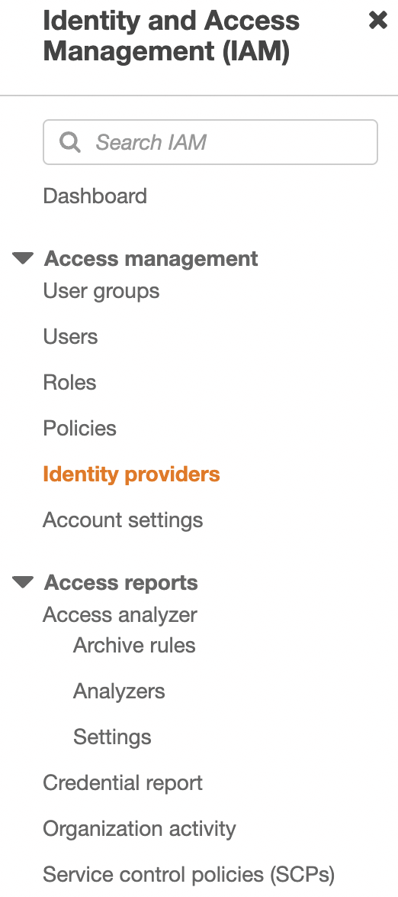
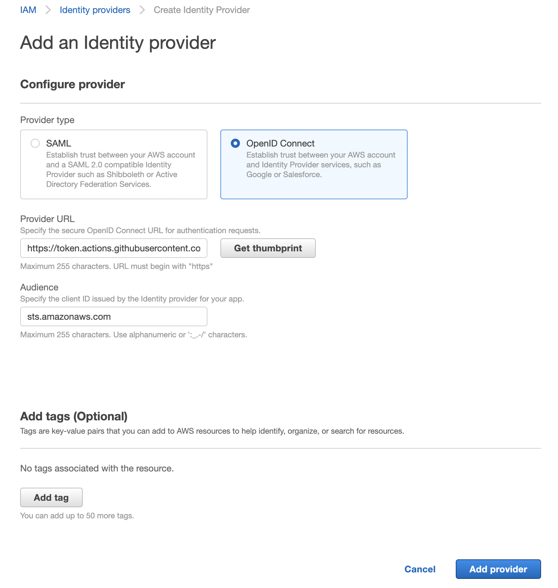

# AWS Secrets Manager

## Overview

The AWS Secrets Manager module allows you to create and manage secrets for your applications securely. This module helps in storing sensitive information such as database credentials, API keys, and other confidential data in AWS Secrets Manager.

## Usage Instructions

### 1. Prerequisites

- Ensure you have [Terraform](https://www.terraform.io/downloads.html) installed.
- Github actions CI that can execute terraform scripts.
- Set up IAM roles and policies that allow access to AWS Secrets Manager.

### Example `terraform.tfvars`

```hcl
# Environment
environment = "dev"  # or "prod", "staging", etc.

# AWS Secrets role and region, this is where the secrets are created
secrets_role_arn = "secret role arn"
secrets_region = "us-east-2"

# AWS Terraform state region, this is the region where terraform store the state
state_region = "us-east-1"

# S3 Bucket Configuration
role_arn        = "uztna-data-dev"  # Customize for your environment
session_name = "123456789012"    # Replace with your AWS account ID
external_id       = "your-external-id" # Replace with your external ID

# Resource Database Configuration
resource_db_username = "resource_user"
resource_db_password = "your-secure-password"  # Replace with actual password
resource_db_host     = "your-resource-db-host.region.rds.amazonaws.com"
resource_db_name     = "resource_db"
resource_db_port     = 5432  # Default PostgreSQL port

# Auth Database Configuration
auth_db_username = "auth_user"
auth_db_password = "your-secure-password"  # Replace with actual password
auth_db_host     = "your-auth-db-host.region.rds.amazonaws.com"
auth_db_name     = "auth_db"
auth_db_port     = 5432  # Default PostgreSQL port
```

### 2. IAM roles

### **State backend role**

The role used by Terraform to access the state backend (S3 bucket).

#### 2.1 Configure OIDC in the AWS account

Create the AWS IAM Identity Provider
We need to create an IAM Identity Provider in AWS.

Go to IAM » Identity Providers.



Click Add Provider on the right side.

Provider type : OpenID Connect.

For the provider URL Use: `https://token.actions.githubusercontent.com`

For the Audience: `sts.amazonaws.com`



#### 2.2 Create a S3 bucket to store tfstate files

Go in S3 » Create bucket

(choose your unique bucket name)

Bucket name: (bucket name)

Click on “Create bucket”

#### 2.3 Create a role to access the S3 bucket

Go in IAM » Roles

Click on “Create role” and fill in the fields in the below JSON definition.

**ACCOUNT A: The account that hosts the S3 bucket.**

Role definition in Account A

```
{
    "Version": "2012-10-17",
    "Statement": [
        {
            "Effect": "Allow",
            "Principal": {
                "Federated": "arn:aws:iam::<s3-bucket-account-id>:oidc-provider/token.actions.githubusercontent.com"
            },
            "Action": "sts:AssumeRoleWithWebIdentity",
            "Condition": {
                "StringEquals": {
                    "token.actions.githubusercontent.com:aud": "sts.amazonaws.com"
                },
                "StringLike": {
                    "token.actions.githubusercontent.com:sub": "repo:<org/user>/<repository name>:*"
                }
            }
        }
    ]
}
```

Policy definition attach to the role

```
{
    "Version": "2012-10-17",
    "Statement": [
        {
            "Effect": "Allow",
            "Action": [
                "s3:PutObject",
                "s3:GetObject",
                "s3:ListBucket",
                "sts:AssumeRole"
            ],
            "Resource": [
                "arn:aws:s3:::<bucket name>/*",
                "arn:aws:s3:::<bucket name>",
                "arn:aws:iam::<other account id>:role/<role that this role assumes in the other account that can create aws secrets>"
            ]
        }
    ]
}
```

**ACCOUNT B: The account that hosts the AWS Secrets.**

Go in IAM » Roles

Click on “Create role” and fill in the fields in the below JSON definition.

Role Definition

```
{
    "Version": "2012-10-17",
    "Statement": [
        {
            "Effect": "Allow",
            "Principal": {
                "AWS": "arn:aws:iam::<Account A>:role/<role name in Account A that has access to the S3 bucket>"
            },
            "Action": "sts:AssumeRole"
        }
    ]
}
```

Policy definition attach to the role

Prebuild Policy name: SecretsManagerReadWrite

JSON definition

```
{
    "Version": "2012-10-17",
    "Statement": [
        {
            "Sid": "BasePermissions",
            "Effect": "Allow",
            "Action": [
                "secretsmanager:*",
                "cloudformation:CreateChangeSet",
                "cloudformation:DescribeChangeSet",
                "cloudformation:DescribeStackResource",
                "cloudformation:DescribeStacks",
                "cloudformation:ExecuteChangeSet",
                "docdb-elastic:GetCluster",
                "docdb-elastic:ListClusters",
                "ec2:DescribeSecurityGroups",
                "ec2:DescribeSubnets",
                "ec2:DescribeVpcs",
                "kms:DescribeKey",
                "kms:ListAliases",
                "kms:ListKeys",
                "lambda:ListFunctions",
                "rds:DescribeDBClusters",
                "rds:DescribeDBInstances",
                "redshift:DescribeClusters",
                "redshift-serverless:ListWorkgroups",
                "redshift-serverless:GetNamespace",
                "tag:GetResources"
            ],
            "Resource": "*"
        },
        {
            "Sid": "LambdaPermissions",
            "Effect": "Allow",
            "Action": [
                "lambda:AddPermission",
                "lambda:CreateFunction",
                "lambda:GetFunction",
                "lambda:InvokeFunction",
                "lambda:UpdateFunctionConfiguration"
            ],
            "Resource": "arn:aws:lambda:*:*:function:SecretsManager*"
        },
        {
            "Sid": "SARPermissions",
            "Effect": "Allow",
            "Action": [
                "serverlessrepo:CreateCloudFormationChangeSet",
                "serverlessrepo:GetApplication"
            ],
            "Resource": "arn:aws:serverlessrepo:*:*:applications/SecretsManager*"
        },
        {
            "Sid": "S3Permissions",
            "Effect": "Allow",
            "Action": [
                "s3:GetObject"
            ],
            "Resource": [
                "arn:aws:s3:::awsserverlessrepo-changesets*",
                "arn:aws:s3:::secrets-manager-rotation-apps-*/*"
            ]
        }
    ]
}
```

### 3. GITHUB secrets and vars

#### Repository secrets

```
AWS_TERRAFORM_STATE_BUCKET_NAME = <bucket name>
AWS_TERRAFORM_STATE_REGION = <region of the bucket>
AWS_TERRAFORM_STATE_ROLE = <arn of the role>
```

#### Envrionment specific secrets

Create an environment and provide these environment variables:

```
# environment / RDC name
ENVIRONMENT = <environment name/ RDC name>

# uztna authentication database creds
AUTH_DB_HOST = <auth db host>
AUTH_DB_NAME = <auth db name>
AUTH_DB_PASSWORD = <auth db password>
AUTH_DB_PORT = <auth db port>
AUTH_DB_USERNAME = <auth db username>

# uztna resource database creds
RESOURCE_DB_HOST = <resource db host>
RESOURCE_DB_NAME = <resource db name>
RESOURCE_DB_PASSWORD = <resource db password>
RESOURCE_DB_PORT = <resource db port>
RESOURCE_DB_USERNAME = <resource db username>

# s3 role creds for s3 sink main connector
EXTERNAL_ID = <external id>
ROLE_ARN = <role arn>
SESSION_NAME = <session name>

# aws secrets manager creds
AWS_SECRET_MANAGEMENT_REGION = <region>
AWS_SECRET_MANAGEMENT_ROLE_ARN = <role arn>
```

### 4. Outputs

After applying the configuration, the following outputs will be available:

- `resource_db_secret_name`: The name of the resource database credentials secret.
- `auth_db_secret_name`: The name of the authentication database credentials secret.
- `role_arn_secret_name`: The name of the role ARN secret.

These outputs can be referenced in other parts of your configuration.
